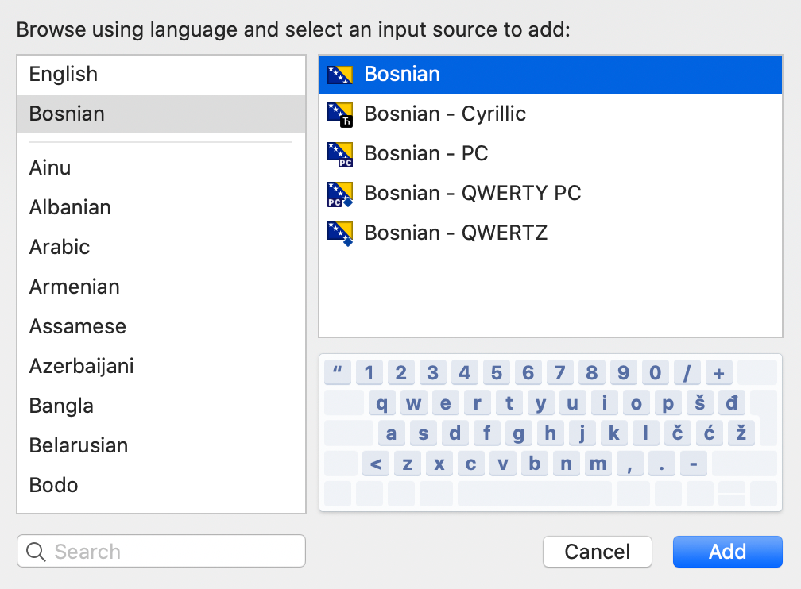

# Bosnian macOS Keyboard Layouts
By default, macOS doesn't include Bosnian keyboard layouts and flag icons. This package adds missing Bosnian icons and layouts.

### Included layouts:
- Bosnian
- Bosnian - PC
- Bosnian - QWERTZ
- Bosnian - Cyrillic
- Bosnian - U.S.
- Bosnian - U.S. - International - PC

## Installation
If you in a hurry use the "Quick" method. Otherwise, **the recommended method is the "Full" installation method.**

### Installation (Quick)

**Please note the shortcomings of this method:** Keyboard layouts will not be available on the lock screen. The layout selection may switch back to a system layout after Sleep and Restart. Please use the full installation method to resolve this.

1. Download the most recent **[Bosnian macOS Keyboard Layouts release](https://github.com/ministryofprogramming/bosnian-macos-keyboard/releases/download/v1.2/bosnian-macos-keyboard_v1.2.zip)**.
2. Extract and copy the extracted `Bosnian.bundle` file to `~/Library/Keyboard Layouts`.
To access the `Library` directory open *Finder* and click the `Go` item in the Menu bar. Press the `Option` (also called `Alt`) key on the keyboard and select `Library` from the list of available directories.
3. Restart your device.
4. Open `System Preferences`, then find the `Keyboard layouts` section. Select the layouts you wish to use.

### Installation (Full) - Recommended

1. Download the most recent **[Bosnian macOS Keyboard Layouts release](https://github.com/ministryofprogramming/bosnian-macos-keyboard/releases/download/v1.2/bosnian-macos-keyboard_v1.2.zip)**.
2. Extract and copy the extracted `Bosnian.bundle` file to `/Library/Keyboard Layouts` (please note that this is not the `~/Library/` user directory,  this is the `/Library/` system directory).
To do this, open the `Terminal` app and execute the following command: `open /Library/Keyboard\ Layouts/`. Paste the bundle into this directory. Enter your admin password once the system asks for it.
3. Restart your device.
4. Open `System Preferences`, then find the `Keyboard layouts` section. Select the layouts you wish to use.

In case of login screen issues try the following steps:
1. Select a Bosnian keyboard layout as the default layout.
2. Open the `Terminal` app and execute following commands (enter your password when asked):
- `sudo cp /Library/Preferences/com.apple.HIToolbox.plist ~/Documents/com.apple.HIToolbox.plist.backup`
- `sudo cp ~/Library/Preferences/com.apple.HIToolbox.plist /Library/Preferences/com.apple.HIToolbox.plist`
3. Restart your device.

If there are any issues with the new preferences you can revert to the backup version by running:
`sudo cp ~/Documents/com.apple.HIToolbox.plist.backup /Library/Preferences/com.apple.HIToolbox.plist`

## Previews

